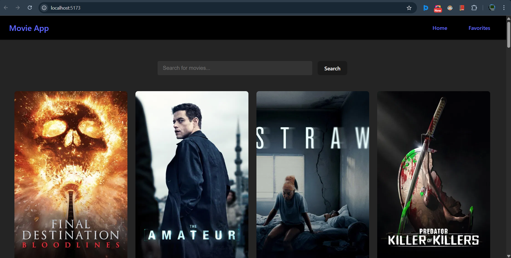
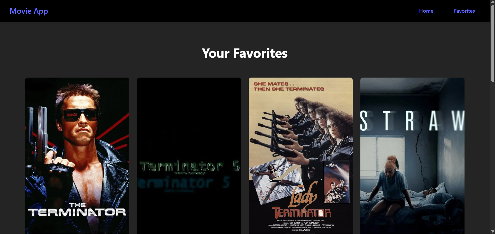

# 🎬 Movie Explorer App

A sleek React application that lets users explore popular movies and search for any film using [The Movie Database (TMDB) API](https://www.themoviedb.org/).


## 📸 Screenshots

### 🏠 Homepage


### 🔍 Search Results


### 🔍 Liked Movies


---

## 🚀 Features

- View popular movies in real-time
- Search for movies by title
- Responsive UI
- Built with React and modern JavaScript (ES6+)
- Powered by TMDB API

---

## 🧰 Tech Stack

- ⚛️ React (Vite)
- 💅 CSS / Tailwind (optional)
- 🌐 TMDB REST API

---

## 🔧 Installation

1. **Clone this repo:**

```bash
git clone https://github.com/Nerf-Ivan/ReactMovieList.git
cd ReactMovieList

2. Install dependencies:

```bash
npm install

3. Set up your .env file:

Create a file named .env in the root directory and add your TMDB API key:
```ini
Edit
VITE_API_KEY=your_tmdb_api_key_here

⚠️ Make sure your .env file is listed in .gitignore so it doesn't get pushed to GitHub!

4. Run the app locally:

```bash
npm run dev
The app will be available at http://localhost:5173 (or another port Vite chooses).

## 📮 Acknowledgements
The Movie Database (TMDB) API 

YouTube Tutorial Source --> https://youtu.be/G6D9cBaLViA?si=BGU8Q79MpLuRvKlD
